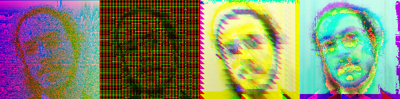

Freelance FullStack Developer with PhD in Datamining.

I use **Python** for LLM/IA/ML, **Java/Kotlin/NodeJS** for backend, **Vue/Angular** for frontend and **Ansible/Docker** for infrastructure.

Contact me for any projects, I love to talk about 0 and 1.

[My blog](http://oliviercavadenti.github.io)

I love programming and parsers but also:

- Modular Synthesizer and music theory.
- Magic The Gathering try hard.
- Sci-Fi Books (Philip K. Dick - Robert Sheckley).
- Comics Sci-Fi : (Philippe Druillet - Tsutomu Nihei - Moebius).
- Experimental music: Aphex Twin, Venetian Snares, Merzbow, Doormouse, Philip Glass, ...
- Movies: David Lynch and Stanley Kubrick.

